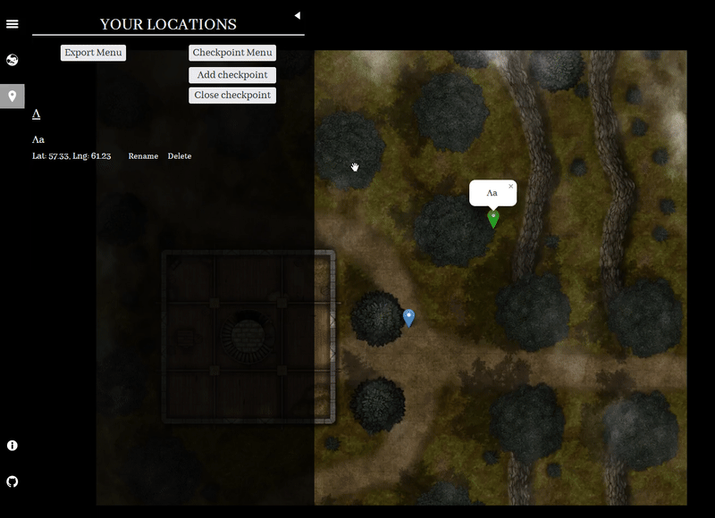
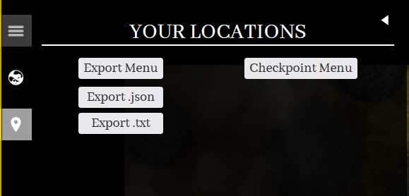
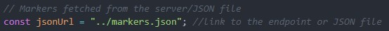

# What is custom maps project?

The custom maps project has been created to help people host their own maps created from static images on the web but it can also be used with OpenStreetMap or any other map api.
This is my first such project so I expect there to be a lot of mistakes and things that could be improved anyway I hope it will come in handy.
## Sidebar icons and tabs


<h3> The globe icon</h3>


 In the tab with the globe icon markers that have been fetched either from the database or static JSON file are being displayed in the form of lists that are grouped by the overlay. *Test overlay* is the name of an overlay to which the marker belongs, overlays can have multiple markers but each marker belongs to only one overlay.
<br> **example**

<hr>


<h3> The map marker icon</h3>

In the tab with the map marker icon takes place a huge part of the javascript, here we have two simple menus one for the checkpoint marker which is used to create new markers and one for exporting created markers.
<br> **example**
<br>

New markers have **rename** and **delete** functions this is a key difference between custom markers and base markers, newly created markers are not stored anywhere, and on the page refresh they disappear. When all the markers in the overlay have been deleted overlay automatically disappears from the sidebar list.
<br> **example**


:heavy_exclamation_mark: The rename function still is kind of bugged but it is usable even then I would advise against abusing it.

## Exporting markers



Created markers can be exported in two formats JSON and txt, exporting markers in JSON format allows you to use them instantly you just have to link to the JSON file location in the javascript file, the code below is such an example, you just have to look for it within the javascript code.


The more advanced way to export markers is by exporting them in txt format, markers in txt file are already prepared for the SQL INSERT statement.
The structure of the txt file goes like this:
<br> ('markerName', 'latitude', 'longitude', 'overlayName'), ...

 **example insert statement**
 ```
 INSERT INTO markers (markerName, latitude, longitude, overlayName)
 VALUES ('A', '(51.49)', '(77.20)', 'A'), ('B', '(16.29)', '(43.88)', 'B'),
 
 ```

 ## Installation

 The installation of development branch is simple, download it, open with VS code or any other IDE that supports command line and run those two commands

 ```
 npm install
 npm start
 ```

When you run *npm start* whenever files in the src directory get changed all of them will get copied to the public folder, you can see how all of this works in package.json